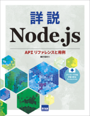

# NodeBook

[「詳説 Node.js」](http://www.cutt.co.jp/book/978-4-87783-489-0.html)（Cutt System刊; July 2020) 掲載のサンプルコードです。

- [第1章](./Section1) 操作編: REPL、コマンドラインオプション、モジュール
- [第2章](./Section2) 環境編: OS、プロセス、標準入出力、コンソール
- [第3章](./Section3) ファイル編: バッファ、パス、ファイルシステム
- [第4章](./Section4) HTTP編: HTTP、HTTPS、URL
- [第5章](./Section5) 構造編: エラー、タイマー、イベント、ユーティリティ
- [第6章](./Section6) ネットワーク編: DNS、Net、UDP
- [第7章](./Section7) 並列処理編: Child Processes、Cluster、Worker Threads
- `SSLKeys` ディレクトリは、第4章の HTTPS サーバの作成で用いた自己署名証明書を収めています。詳細はこのディレクトリの `README.txt` を参照してください。
- `LoremIpsum.txt` は第2章などで、パラグラフ単位に分かれたやや長めのテキストを処理をしたときのサンプルファイルです。このファイルでなくてもサンプルコードは動作しますが、書籍とおなじ結果を得たいときにお使いください。

Sample Node.js scripts from ["Node.js Explained - API and Examples"](http://www.cutt.co.jp/book/978-4-87783-489-0.html), Cutt System, July 2020 (544 pages).

- [Chapter 1](./Section1): REPL, Command Line Options and Modules
- [Chapter 2](./Section2): OS, Process and Console
- [Chapter 3](./Section3): Buffer, Path and File System (fs)
- [Chapter 4](./Section4): HTTP, HTTPS and URL
- [Chapter 5](./Section5): Errors, Timers, Events and Utilities
- [Chapter 6](./Section6): DNS, Net (TCP & Unix domain socket) and UDP
- [Chapter 7](./Section7): Child Processes, Cluster, Worker Threads and Performance measurement
- The `SSLKeys` directory contains the self-signed certificate used in the HTTPS section (Chapter 4). See `README.txt` in this directory for details (in Japanese).
- `LoremIpsum.txt` is a sample file for scripts that parse long texts into paragraphs (Chapter 2). The codes should work with other text files.

ご購入は [honto](https://honto.jp/netstore/pd-book_30361360.html) などからどうぞ。